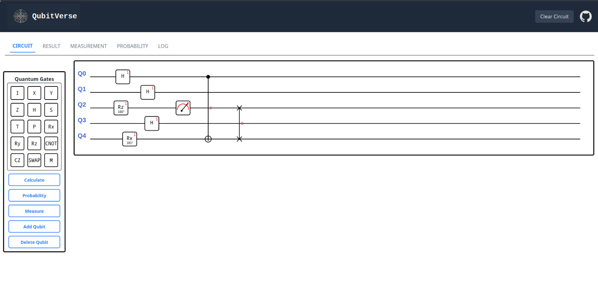
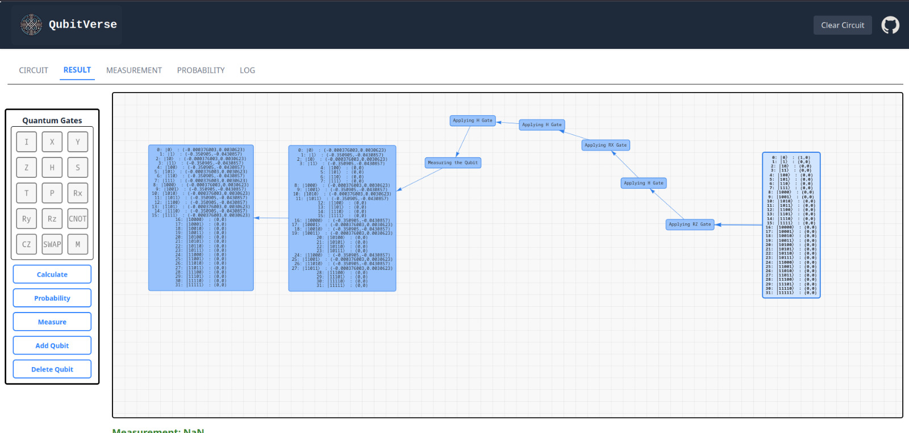
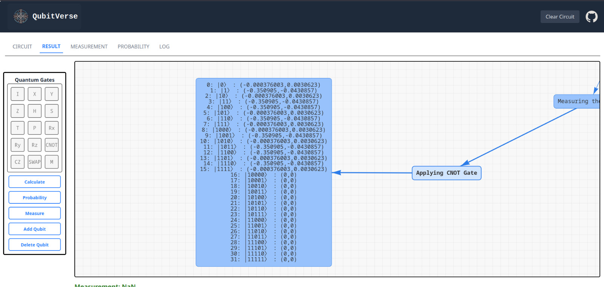
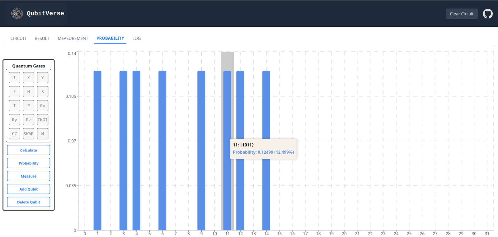
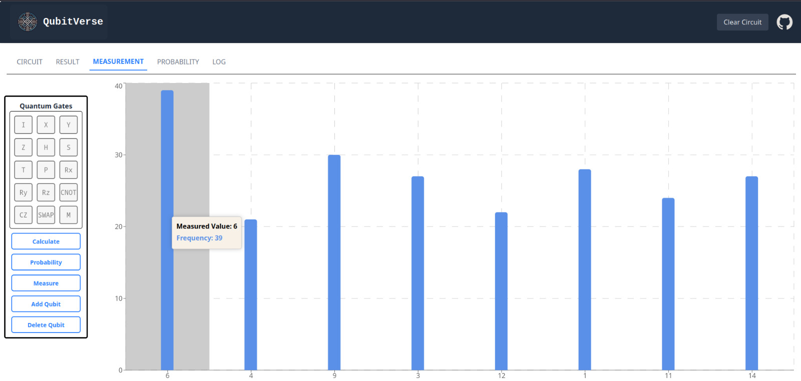
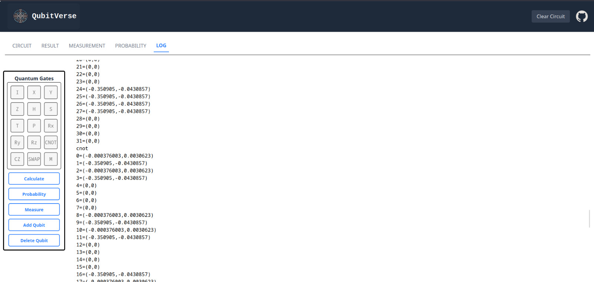

# Team - QubitStorm

# Projet - QubitVerse

**A high-performance Quantum Computer Circuit Simulator written in C++.**

# Problem Statement

Currently, access to actual quantum hardware remains limited due to high costs, complex underlying principles, and technical barriers—making it largely inaccessible to students, educators, and early-stage researchers.
There is a need for an intuitive and visual simulation tool that facilitates hands-on learning, experimentation, and prototyping without relying on real quantum systems.
Existing simulators struggle with lower computational power, bad design architecture, no visual feedback, and support for only single qubit system.

## Overview

QubitVerse is a quantum computing simulation Software that allows users to design, simulate, and visualize quantum circuits. The project is built with modern C++ (C++23) and focuses on performance optimization.

## Features

- **Quantum Circuit Simulation**: Simulate quantum circuits with various quantum gates
- **Visualization**: Circuit visualization capabilities
- **High Performance**: Optimized for performance with modern C++ features

## Tech Stack Used

- C++
- React.JS
- React-konva

## Project Structure

```
qubitverse/
├── simulator/          # Core simulation engine
│   ├── parser/        # Circuit description parser
│   ├── simulator/     # Main simulation logic
│   ├── lexer/         # Lexical analysis
│   ├── gates/         # Quantum gate implementations
│   └── dep/           # Dependencies
└── visualizer/        # Circuit visualization components
```

## Building

### Prerequisites

- CMake (version 3.10 or higher)
- C++23 compatible compiler
- Clang/LLVM (recommended)
- Simulator only Linux Compatible

### Build Instructions

1. Clone the repository:

   ```bash
   git clone https://github.com/yourusername/qubitstorm.git
   cd qubitstorm
   ```

2. Configure and build:
   ```bash
   cd simulator
   npm install
   cd ..
   cd visualizer
   npm install
   npm run dev
   ```

The project uses aggressive optimization flags for maximum performance:

- O3 optimization
- Native architecture tuning
- Loop unrolling
- Intel assembly syntax

# Working Screenshots










# Video Demo
https://drive.google.com/file/d/1LkB84bIZNohphwi5uWzMs8DUhXvJGGu1/view?usp=sharing

## License

This project is licensed under the terms specified in the LICENSE file.
